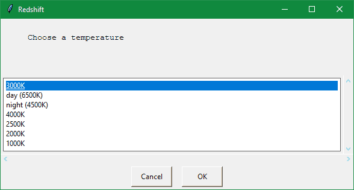

# pyredshift
A minimalist GUI for redshift on Raspberry py OS to change screen temperature, written in python.
It just a shell script quickly written for my own usage, but someone might find it useful.

# Install
  * you need the redshift package from the repository, if it's not already installed.
  * install easygui (pip install easygui) : easy tkinter "dialog in one function" module for a few kB.
  * copy redshift.py where you want, make executable (chmod +x), make a shortcut and run.

(It will look like more gnome style on raspberry.)

